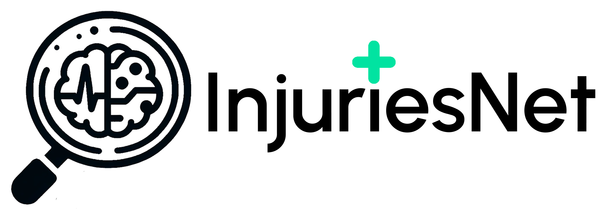

# aihack2023
Melbourne AI Hackathon 2023

12:30 18/11 Noting Conversation with Jamie and Lucas who accepted the private VAFA sourced injury data licensed to
the charity Communities and made available by them to the Hackathon team.

# InjuriesNet: Enhancing Recovery through Predictive Analytics Content

  

## 🔗 Table of Contents
1. [General Information](#general-information)
2. [Demo](#demo)
3. [How to install](#how-to-install)
4. [Built with](#built-with)
5. [Credits and Acknowledgments](#credits-and-acknowledgments)
6. [Contact](#contact)

## 🔭 General Information
InjuriesNet is an AI-driven predictive analytics model designed to automate sports injury recovery management. It enhances efficiency by predicting recovery progress and ensuring patient adherence to treatment plans. The model aims to evolve for broader healthcare applications, focusing on cost-effective and accessible care in various settings, including remote communities.

#### 🔍 Problem: 
Specialist Direct and Personify need automation via machine learning to scale their effective sports injury recovery management, as current manual processes rely on human intervention to detect recovery issues and insufficient patient feedback

#### 💡 Proposed Solution: 
A Predictive Analytics Model with two main components: predicting recovery progress and monitoring survey adherence.

#### 🚀 Future Directions: 
Extend the ML approach to various healthcare settings, aiming for cost-effective care and supporting AI research in a remote Northern Territory community.

## 📦 Demo

## 📚 How to install
Please read build instructions about the machine learning model in the .

## 🛠 Built with

## 👏 Credits and Acknowledgments
Many thanks to:
- [Victorian Amateur Football Association(VAFA)](https://www.vafa.com.au/)

## 📧 Contact
For any questions or inquiries, feel free to reach out to us via:
